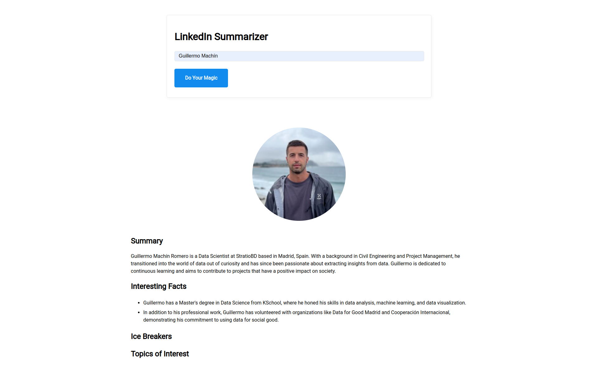

# Exploring LangChain! 🦜️🔗

Este repositorio contiene diversas pruebas y experimentos realizados para aprender y explorar las capacidades del framework [LangChain](https://langchain.com/). Aquí encontrarás ejemplos de cómo utilizar las distintas herramientas que proporciona LangChain para la creación de aplicaciones basadas en inteligencia artificial, flujos de trabajo y manejo de grandes lenguajes de modelo (LLM).


## Contenido

El contenido del repositorio permite ejecutar diferentes scripts de Python con el framework de Langchain con la idea de explorar:
- Utilizar LLM tanto de forma online como en local
- Conexiones a APIs
- Desarrollo de agentes (Agents)
- Desarrollo de herramientas (Tools)
- Trazabilidad con LangSmith 


## Resultado

El resultado del proyecto es desplegar un frontal en local, que dado el nombre de un usuario de LinkedIn, se capaz de resumir su perfil, y de mostrar 2 datos interesantes de su perfil.

[Aspiracional]
En futuras iteraciones se espera generar también de forma automática un mensaje llamativo para contactar con el por LinkedIn, en base al contenido de su perfil.




## Instalación

Para clonar este repositorio y comenzar a experimentar con LangChain, sigue estos pasos:

```bash
git clone https://github.com/gmachinromero/exploring-langchain.git
cd exploring-langchain
```

Asegúrate de tener instalado Python 3.11+ y pipenv para crear un entorno con todas las dependencias necesarias:

```bash
pipenv install
```

Para desplegar el frontal debes ejecutar:
```bash
python app.py
```

Adicionalmente necesitarás los token siguientes en un fichero de configuración `.env`:
- `OPENAI_API_KEY`
- `PROXYCURL_API_KEY`
- `TAVILY_API_KEY`
- `LANGCHAIN_TRACING_V2`
- `LANGCHAIN_ENDPOINT`
- `LANGCHAIN_API_KEY`
- `LANGCHAIN_PROJECT`

Dado que el uso de algunas de estas APIs como proxycurl es limitado, se almacenan response tipo en GitHub Gist para poder trabajar de forma continuada sin agotar el número de llamadas límite a la API.

## Esquema
El repositorio tiene la siguiente estructura de carpetas:

```
exploring-langchain/
├── agents/
│   ├── __init__.py
│   └── linkedin_lookup_agent.py
├── parsers/
│   ├── __init__.py
│   └── output_parser.py
├── third_party/              
│   ├── __init__.py
│   └── linkedin.py
├── tools/
│   ├── __init__.py
│   └── tools.py
├── templates/                 # Plantilla para el frontal
│   └── index.html
├── .env                       # Fichero para API_KEYS
├── .gitignore                 # Archivos a ignorar por Git
├── app.py                     # Desplegar app con linkedin_summarizer.py
├── ice_breaker.py             # PoC
├── linkedin_summarizer.py     # Código principal
├── Pipfile                    # Dependencias del proyecto
├── Pipfile.lock               # Dependencias del proyecto
└── README.md                  # Descripción general del proyecto
```

## Recursos
- https://python.langchain.com/v0.2/docs/introduction/
- Udemy: LangChain- Develop LLM powered applications with LangChain

